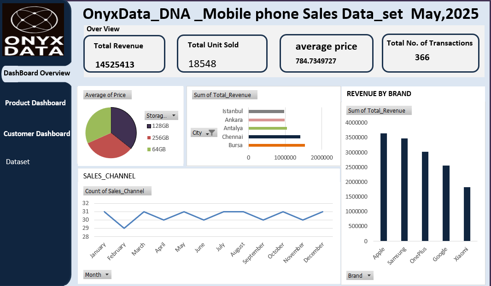

# Mobile Phone Sales(Onyx)

## Introduction

At the beginning of my data analysis journey, I started with Excel, using the **Onyx Data DNA May Mobile Phone Sales dataset** as a practical resource for hands-on practice. The key concepts I explored included pivot table calculations and inserting charts for data visualization.

## Problem Statement

- Which **brands** generate the highest revenue and unit sales?
-	What **storage size** and **mobile models** are most popular among customers?
-	How do **sales channels** (online, retail, partner) contribute to total transactions?
-	Which **customer demographics** (age, gender) drive the most revenue?
-	Which **cities** generate the highest sales performance?
-	How can management use these insights to **improve sales strategy and resource allocation**?

## Skilled Demonstrated

-	**Data Cleaning & Transformation:** Handling missing values, removing duplicates, and preparing structured data.
-	**Excel Functions & Pivot Tables:** Aggregating and summarizing key metrics.
-	**Data Visualization:** Using charts, slicers, and dashboards for storytelling.
-	**Business Intelligence & Analysis:** Identifying trends, patterns, and insights from data.
-	**KPI Design:** Tracking revenue, unit sales, average price, and transaction counts.

## Data Sourcing 
The dataset was sourced from OnyxData DNA and contains mobile phone sales transactions. It is structured into four sheets:
-	**Fact Sales** – 20 columns and 367 rows, capturing detailed transaction records.
-	**Dim Products** – 5 columns and 275 rows, containing product-related attributes.
-	**Dim Locations** – 4 columns and 26 rows, representing the geographic coverage of sales.
-	**Data Dictionary** – 2 columns and 21 rows, providing descriptions and definitions of dataset fields.

## Data Cleaning and Pivoting process

-	A new worksheet was created and named Worksheet, into which all datasets from the Facts sheet were copied.
-	Duplicate records were removed, and checks were performed to ensure no transaction records were missing.
-	Five (5) new calculated columns were added to the Facts sheet table:
1. **Month** – Extracted from the End of Month column using the formula: = **_TEXT(D7,"mmmm")_**.
2.	**Weekday** – Extracted from the End of Month column using the formula: =  **_TEXT(D7,"dddd")_**.
3.	**Price Category** – Categorized based on price using: = **_IF(L7<500,"Low",IF(L7<=1000,"Medium","High"))_**.
4.	**Revenue per Unit** – Calculated as =**O7/N7**, where O7 references Total Revenue and N7 references Units Sold.
5.	**Customer Age Category** – Classified into groups using: =_**IF(S7<=25,"Youngest",IF(S7<=33,"Young",IF(S7<=41,"Youth",IF(S7<=49,"Adult",IF(S7<=57,"Old","Elder")))))**_.
-	A new sheet named Pivot was created, and PivotTables were used to derive key performance indicators (KPIs), including: Sum of Total Revenue,Sum of Units Sold,Average Price,Count of Transaction IDs,Top-Selling Brand,Best-Selling Storage Size,Revenue by Gender,Most Popular Payment Method,Sales Channel Distribution.
-	Pivot matrix calculations were also performed, with corresponding charts inserted for visualization:
-**Pie Chart** – Average Price by Storage Size
-**Bar Chart** – Total Revenue by City
_**Line Graph** – Sales Channel by Month
-**Bar Chart** – Total Revenue by Brand
-**Donut Chart** – Units Sold by Operating System
-**Clustered Bar Chart** – Total Revenue by Customer Age Category and Gender

## Analysis and Visualization

